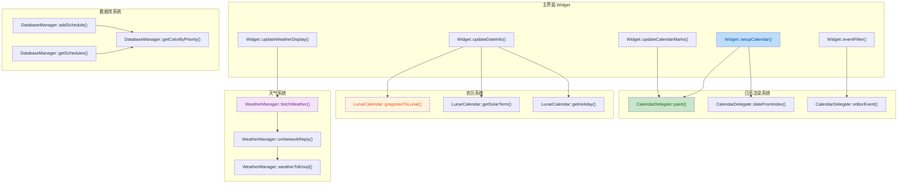

## 1. 高层摘要（TL;DR）

**影响范围**：🔴 **高** - 涉及核心日历组件重构、新增农历功能、UI全面优化

**关键变更**：
- ✨ 新增农历日历支持（LunarCalendar类）
- 🎨 日历界面重构，使用自定义Delegate实现三态配色
- 🌤️ 天气功能升级，支持未来3天预报
- 🗓️ 日程管理UI优化，添加动画效果
- 🎯 集成QtAwesome图标库
- 📝 数据库扩展，添加日程颜色字段

---

## 2. 可视化概览（代码与逻辑映射）



---

## 3. 详细变更分析

### 📅 3.1 日历系统重构

#### **CalendarDelegate（新增文件）**

**功能概述**：自定义QStyledItemDelegate实现日历单元格的三态配色和交互

**核心方法**：

| 方法 | 功能 | 关键逻辑 |
|------|------|----------|
| `paint()` | 绘制日历单元格 | 根据优先级/今天/非当月设置不同背景色 |
| `dateFromIndex()` | 索引转日期 | 计算行列对应的QDate |
| `editorEvent()` | 处理点击事件 | 触发`dateClicked`信号 |
| `getMaxPriority()` | 获取最高优先级 | 返回某日期日程的最大优先级 |

**配色方案**：

```cpp
// 今天日期（加粗 + 边框）
if (isToday) {
    font.setBold(true);
    drawBorder = true;
    // 根据优先级设置背景色
    if (maxPriority == 2) backgroundColor = QColor(255, 180, 180);  // 紧急
    else if (maxPriority == 1) backgroundColor = QColor(255, 255, 180);  // 重要
    else if (maxPriority == 0) backgroundColor = QColor(180, 200, 255);  // 一般
    else backgroundColor = QColor(245, 245, 245);  // 无日程
}
// 非当月日期（灰色文字）
else if (!isCurrentMonth) {
    backgroundColor = QColor(238, 238, 238);
    textColor = QColor(51, 51, 51, 150);
}
// 当月有日程
else if (maxPriority == 2) backgroundColor = QColor(255, 180, 180);
else if (maxPriority == 1) backgroundColor = QColor(255, 255, 180);
else if (maxPriority == 0) backgroundColor = QColor(180, 200, 255);
```

**源文件**：`CalendarDelegate.cpp` (新增203行)

---

### 🌙 3.2 农历日历系统（新增）

#### **LunarCalendar类**

**功能概述**：实现公历与农历转换、节气计算、节日查询

**核心数据结构**：

```cpp
struct LunarDate {
    int year;       // 农历年
    int month;      // 农历月（1-12）
    int day;        // 农历日（1-30）
    bool isLeap;    // 是否闰月
    QString toString() const;
    bool isValid() const;
};
```

**主要方法**：

| 方法 | 功能 | 支持范围 |
|------|------|----------|
| `gregorianToLunar()` | 公历转农历 | 1900-2100年 |
| `lunarToGregorian()` | 农历转公历 | 1900-2100年 |
| `getSolarTerm()` | 获取节气 | 24节气 |
| `getHoliday()` | 获取节日 | 农历节日+公历节日 |
| `isLunarLeapMonth()` | 判断闰月 | 支持闰月 |

**节气数据**：包含2016-2030年的24节气精确日期（626行数据）

**节日支持**：
- 农历节日：春节、元宵节、清明节、端午节、中秋节、重阳节、除夕
- 公历节日：元旦、情人节、愚人节、劳动节、儿童节、建党节、建军节、教师节、国庆节、圣诞节

**源文件**：
- `LunarCalendar.h` (新增65行)
- `LunarCalendar.cpp` (新增626行)

---

### 🌤️ 3.3 天气系统升级

#### **WeatherManager改进**

**变更内容**：

| 项目 | 旧版本 | 新版本 |
|------|--------|--------|
| API参数 | `extensions=base` | `extensions=all` |
| 数据解析 | lives数组 | forecasts.casts数组 |
| 预报数据 | 模拟数据 | 真实3天预报 |
| 天气图标 | 文字描述 | Emoji图标 |
| 错误处理 | 简单提示 | 详细调试日志 |

**新增方法**：

```cpp
// 天气转Emoji
static QString weatherToEmoji(const QString &weather) {
    if (weather.contains("晴")) return "🌤 " + weather;
    if (weather.contains("阴")) return "☁️ " + weather;
    if (weather.contains("雨")) {
        if (weather.contains("雷")) return "⛈ " + weather;
        if (weather.contains("大")) return "🌧 " + weather;
        return "🌧 " + weather;
    }
    if (weather.contains("雪")) return "❄️ " + weather;
    // ... 更多天气类型
}
```

**预报数据结构**：

```cpp
struct WeatherInfo {
    QString city;
    QString temperature;        // 当天温度
    QString temperatureRange;    // 温度区间 "18~25°C"
    QString condition;           // 天气状况（带Emoji）
    QString wind;
    QString forecast[3];         // 未来3天预报
};
```

**源文件**：`WeatherManager.cpp` (+229行)

---

### 🗃️ 3.4 数据库扩展

#### **Schedule结构体变更**

**新增字段**：

```cpp
struct Schedule {
    // ... 原有字段
    QColor color;  // 新增：日程颜色，根据priority自动设置
};
```

**数据库Schema变更**：

```sql
-- 新增color字段
ALTER TABLE schedules ADD COLUMN color TEXT DEFAULT '';

-- 插入/更新时自动设置颜色
INSERT INTO schedules (..., color) VALUES (?, ..., ?)
-- color值根据priority自动设置：
-- priority=2 → "red"
-- priority=1 → "orange"
-- priority=0 → "blue"
```

**颜色映射方法**：

```cpp
static QColor getColorByPriority(int priority) {
    switch (priority) {
    case 2: return Qt::red;           // 紧急：红色
    case 1: return QColor(255, 165, 0);  // 重要：橙色
    default: return Qt::blue;         // 一般：蓝色
    }
}
```

**源文件**：
- `DatabaseManager.h` (+2行)
- `DatabaseManager.cpp` (+38行)

---

### 🎨 3.5 UI界面优化

#### **Widget界面重构**

**日历样式表**：

```css
QCalendarWidget {
    background-color: #F5F5F5;
    border: 1px solid #333333;
    color: #333333;
}

QCalendarWidget QWidget#qt_calendar_navigationbar {
    background-color: #333333;
    color: #F5F5F5;
}

QCalendarWidget QTableView::item {
    background-color: transparent;
    color: #333333;
    padding: 2px;
}
```

**天气组件重构**：

| 组件 | 旧布局 | 新布局 |
|------|--------|--------|
| 日期显示 | 单行 | 多行（日期+农历+节气） |
| 天气图标 | 大图标 | 移除（使用Emoji） |
| 温度显示 | 单温度 | 温度区间 |
| 预报显示 | 简单文本 | 结构化3天预报 |

**新增日期信息显示**：

```cpp
void Widget::updateDateInfo() {
    QDate today = QDate::currentDate();
    
    // 公历日期
    QString dateStr = QString("%1 月 %2 日").arg(today.month()).arg(today.day());
    ui->dateLabel->setText(dateStr);
    
    // 农历日期
    QString lunarDate = m_lunarCalendar->getLunarDateString(today);
    ui->lunarLabel->setText(lunarDate);
    
    // 节气
    QString solarTerm = m_lunarCalendar->getSolarTerm(today);
    ui->solarTermLabel->setText(solarTerm);
}
```

**源文件**：
- `Widget.h` (+13行)
- `Widget.cpp` (+268行)
- `Widget.ui` (UI布局调整)

---

### 🎯 3.6 图标系统集成

#### **QtAwesome集成**

**CMakeLists.txt变更**：

```cmake
# 添加QtAwesome子目录
add_subdirectory(lib/QtAwesome)

# 设置包含路径
include_directories(
    ${CMAKE_CURRENT_SOURCE_DIR}/lib/QtAwesome/QtAwesome
)

# 链接库
target_link_libraries(PersonalDateAssisant PRIVATE 
    Qt${QT_VERSION_MAJOR}::Widgets 
    Qt${QT_VERSION_MAJOR}::Sql 
    Qt${QT_VERSION_MAJOR}::Network 
    QtAwesome
)

# 添加包含目录
target_include_directories(PersonalDateAssisant PRIVATE
    ${CMAKE_CURRENT_SOURCE_DIR}/lib/QtAwesome
    ${CMAKE_CURRENT_SOURCE_DIR}/lib/QtAwesome/QtAwesome
)
```

**图标设置**：

```cpp
void Widget::setupAwesomeIcons() {
    m_awesome->setDefaultOption("color", QColor(85, 85, 85));
    m_awesome->setDefaultOption("scale-factor", 0.8);

    // 添加按钮图标
    QIcon addIcon = m_awesome->icon(fa_solid, fa_plus);
    ui->addScheduleButton->setIcon(addIcon);
    
    QIcon calendarIcon = m_awesome->icon(fa_solid, fa_calendar);
    ui->viewAllSchedulesButton->setIcon(calendarIcon);
    
    QIcon settingsIcon = m_awesome->icon(fa_solid, fa_cog);
    ui->settingsButton->setIcon(settingsIcon);
}
```

**源文件**：`Widget.cpp` (+49行)

---

### 📋 3.7 日程管理UI优化

#### **ScheduleDetailDialog改进**

**新增功能**：

1. **关闭动画**：
```cpp
void ScheduleDetailDialog::animateClose() {
    m_closeAnimation = new QPropertyAnimation(this, "windowOpacity", this);
    m_closeAnimation->setDuration(200);
    m_closeAnimation->setStartValue(1.0);
    m_closeAnimation->setEndValue(0.0);
    m_closeAnimation->setEasingCurve(QEasingCurve::InCurve);
    connect(m_closeAnimation, &QPropertyAnimation::finished, 
            this, &ScheduleDetailDialog::performClose);
    m_closeAnimation->start();
}
```

2. **点击外部关闭**：
```cpp
bool ScheduleDetailDialog::eventFilter(QObject* watched, QEvent* event) {
    if (event->type() == QEvent::MouseButtonPress) {
        QMouseEvent* mouseEvent = static_cast<QMouseEvent*>(event);
        QPointF globalPosF = mouseEvent->globalPosition();
        QPoint dialogPos = mapFromGlobal(globalPosF.toPoint());
        
        if (!rect().contains(dialogPos)) {
            animateClose();
            return true;
        }
    }
    return QDialog::eventFilter(watched, event);
}
```

3. **卡片样式优化**：
- 使用圆角卡片（12px）
- 优先级彩色小圆点标识
- 悬停效果（边框变色）

**源文件**：
- `ScheduleDetailDialog.h` (+9行)
- `ScheduleDetailDialog.cpp` (+236行)

#### **ScheduleListDialog改进**

**新增最小化功能**：

```cpp
// 最小化/展开按钮
QPushButton* minimizeButton = new QPushButton();
minimizeButton->setFixedSize(28, 28);
minimizeButton->setToolTip(schedule.datetime.toString("yyyy-MM-dd HH:mm"));

// 动画效果
QPropertyAnimation* animation = new QPropertyAnimation(cardFrame, "minimumHeight");
animation->setDuration(300);
animation->setEasingCurve(QEasingCurve::OutCubic);
```

**状态管理**：
```cpp
QMap<int, bool> m_minimizedState;  // 存储每个日程项的最小化状态
QMap<int, QPropertyAnimation*> m_animations;  // 存储动画对象
```

**源文件**：
- `ScheduleListDialog.h` (+4行)
- `ScheduleListDialog.cpp` (+237行)

---

### ⚙️ 3.8 设置对话框改进

#### **SettingsDialog新增配置显示**

**新增UI组件**：

| 组件 | 功能 |
|------|------|
| `currentApiKeyDisplayLabel` | 显示当前API密钥 |
| `currentCityDisplayLabel` | 显示当前城市 |
| `configGroupBox` | 配置信息分组框 |

**加载配置方法**：

```cpp
void SettingsDialog::loadConfigDisplay() {
    QString configPath = QStandardPaths::writableLocation(QStandardPaths::AppDataLocation) 
                        + "/weather_settings.ini";
    QFile file(configPath);
    
    QString apiKey;
    QString city;
    bool enabled = false;
    
    if (file.exists() && file.open(QIODevice::ReadOnly | QIODevice::Text)) {
        QTextStream in(&file);
        while (!in.atEnd()) {
            QString line = in.readLine();
            if (line.startsWith("apiKey=")) apiKey = line.mid(7);
            else if (line.startsWith("city=")) city = line.mid(5);
            else if (line.startsWith("enabled=")) 
                enabled = (line.mid(8) == "1");
        }
        file.close();
    }
    
    ui->currentApiKeyDisplayLabel->setText(enabled && !apiKey.isEmpty() ? apiKey : "未配置");
    ui->currentCityDisplayLabel->setText(enabled && !city.isEmpty() ? city : "未设置");
}
```

**源文件**：
- `SettingsDialog.h` (+2行)
- `SettingsDialog.cpp` (+29行)
- `SettingsDialog.ui` (+49行)

---

### 📚 3.9 文档新增

#### **设计文档**

| 文档 | 内容 |
|------|------|
| `GRAY_CALENDAR_DESIGN.md` | 灰色配色方案设计（WCAG对比度分析） |
| `CALENDAR_THREE_STATE_DESIGN.md` | 日历三态配色设计 |
| `CALENDAR_GRAY_IMPLEMENTATION_SUMMARY.md` | 灰色配色实施总结 |
| `TODAY_MARKER_FEATURE.md` | 今天日期标注功能说明 |

#### **许可证**

- 新增 `LICENSE.md`：MIT License

---

### 🔧 3.10 构建系统变更

#### **CMakeLists.txt**

**新增测试程序**：

```cmake
# 农历测试程序
add_executable(LunarCalendarTest test_lunar.cpp LunarCalendar.cpp LunarCalendar.h)
target_link_libraries(LunarCalendarTest PRIVATE Qt${QT_VERSION_MAJOR}::Core)

# 闰月检查测试程序
add_executable(LunarLeapTest test_leap_check.cpp LunarCalendar.cpp LunarCalendar.h)
target_link_libraries(LunarLeapTest PRIVATE Qt${QT_VERSION_MAJOR}::Core)
```

**依赖库**：
- 新增 `QtAwesome` 图标库

**源文件**：`CMakeLists.txt` (+18行)

---

## 4. 影响与风险评估

### ⚠️ 破坏性变更

| 变更项 | 影响 | 兼容性 |
|--------|------|--------|
| 数据库Schema | 新增`color`字段 | ✅ 向后兼容（使用ALTER TABLE） |
| 日历渲染方式 | 从QTextCharFormat改为Delegate | ✅ 功能增强，不破坏现有数据 |
| 天气API | 从`base`改为`all` | ⚠️ 需要API支持`extensions=all` |

### 🧪 测试建议

**功能测试**：
- [ ] 农历日期转换准确性（1900-2100年）
- [ ] 节气日期验证（对比官方数据）
- [ ] 日历三态配色显示（今天/有日程/普通）
- [ ] 天气3天预报数据解析
- [ ] 日程颜色自动设置
- [ ] 日程详情对话框关闭动画
- [ ] 日程列表最小化/展开功能
- [ ] 点击外部关闭对话框

**边界测试**：
- [ ] 闰年2月29日农历转换
- [ ] 闰月日期处理
- [ ] 空日程列表显示
- [ ] 网络异常时的天气处理
- [ ] 数据库color字段为空的情况

**性能测试**：
- [ ] 日历切换月份时的渲染性能
- [ ] 大量日程（100+）时的列表滚动性能
- [ ] 天气API请求频率控制

### 📊 代码统计

| 类别 | 文件数 | 新增行数 |
|------|--------|----------|
| 新增源文件 | 2 | 829 |
| 新增头文件 | 2 | 107 |
| 修改源文件 | 7 | +747 |
| 修改头文件 | 4 | +16 |
| UI文件 | 2 | +100 |
| 文档 | 4 | 525 |
| 构建文件 | 2 | +18 |
| **总计** | **23** | **~2342** |

---

## 5. 总结

本次更新是一个**重大功能升级**，主要亮点包括：

1. **🌙 农历支持**：完整的农历日历系统，支持1900-2100年的公农历互转、24节气、传统节日
2. **🎨 UI重构**：日历三态配色、卡片式日程显示、动画效果、图标系统
3. **🌤️ 天气升级**：真实3天预报、Emoji天气图标、详细错误处理
4. **🗃️ 数据库扩展**：日程颜色字段，自动根据优先级设置
5. **📚 文档完善**：WCAG对比度分析、设计文档、实施总结

**建议**：
- 在发布前进行充分的农历日期准确性测试
- 验证天气API的`extensions=all`参数支持
- 测试大量日程情况下的性能表现
- 确保所有UI动画在不同平台上的流畅性