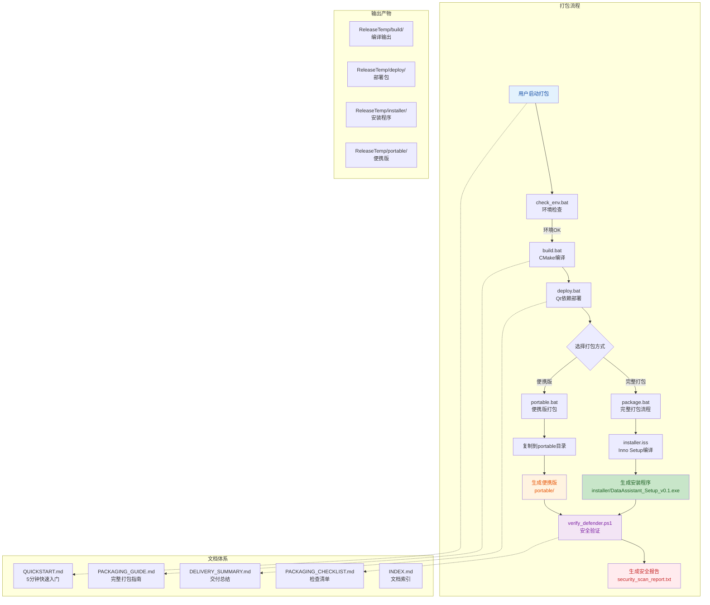
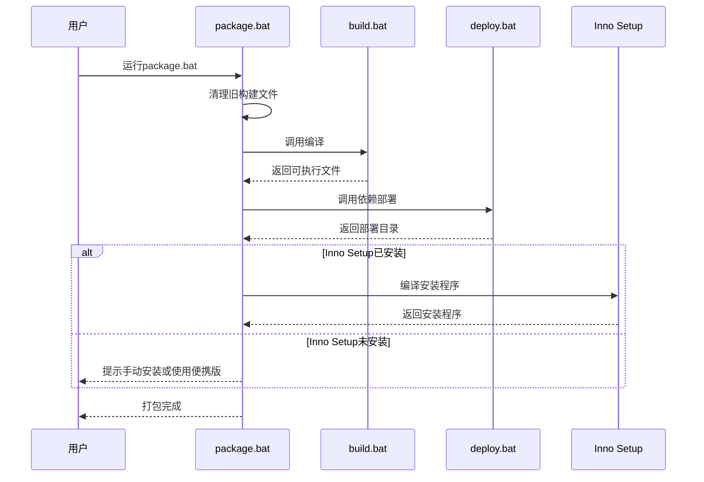
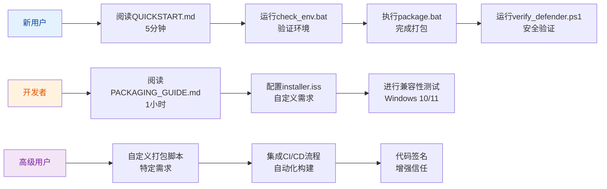

## 1. 高层摘要 (TL;DR)

*   **影响**: **高** - 为DataAssistant项目添加了完整的Windows平台打包基础设施，包括自动化脚本、详细文档和安全验证机制
*   **核心变更**:
    *   ✨ 新增7个打包脚本，支持完整安装程序和便携版两种打包方式
    *   📚 新增5个详细文档，提供从快速入门到高级配置的完整指导
    *   🔒 集成Windows Defender安全验证，确保打包文件安全性
    *   🛠️ 提供环境检查工具，快速诊断打包环境问题

---

## 2. 可视化概览 (代码与逻辑映射)



### 打包脚本功能矩阵

| 脚本名称 | 主要功能 | 输入 | 输出 | 依赖工具 |
|---------|---------|------|------|---------|
| `check_env.bat` | 环境诊断 | - | 环境检查报告 | 无 |
| `build.bat` | 项目编译 | 源代码 | `build/PersonalDateAssisant.exe` | CMake, MinGW |
| `deploy.bat` | 依赖部署 | 可执行文件 | `deploy/` 目录 | windeployqt |
| `package.bat` | 完整打包 | 源代码 | 安装程序 | CMake, windeployqt, Inno Setup |
| `portable.bat` | 便携版打包 | 可执行文件 | `portable/` 目录 | windeployqt |
| `verify_defender.ps1` | 安全验证 | 打包文件 | 安全扫描报告 | Windows Defender |
| `installer.iss` | 安装配置 | 部署目录 | 安装程序 | Inno Setup |

---

## 3. 详细变更分析

### 📦 组件1: 打包脚本系统

#### 1.1 核心构建脚本 (`build.bat`)

**功能**: 使用CMake和MinGW编译Qt项目

**关键流程**:
```batch
[Step 1/3] 清理构建目录
    ↓
[Step 2/3] 配置CMake项目
    - 使用MinGW Makefiles生成器
    - 设置Release构建类型
    - 配置输出目录
    ↓
[Step 3/3] 编译项目
    - 使用多核并行编译 (-j%NUMBER_OF_PROCESSORS%)
    ↓
输出: ReleaseTemp/build/PersonalDateAssisant.exe
```

**错误处理机制**:
- CMake配置失败时提供详细错误信息和解决方案
- 编译失败时提示检查源代码和依赖项

#### 1.2 依赖部署脚本 (`deploy.bat`)

**功能**: 使用windeployqt自动部署Qt运行时库

**部署内容**:
| 类别 | 包含内容 |
|------|---------|
| Qt核心库 | Qt6Core.dll, Qt6Gui.dll, Qt6Widgets.dll |
| Qt模块 | SQL, Network等模块DLL |
| 运行时库 | MinGW运行时, Visual C++运行时 |
| 资源文件 | QtAwesome字体文件 |

**关键特性**:
- 自动检测windeployqt工具
- 支持增量部署（源代码未变时快速重新打包）
- 自动复制QtAwesome字体资源

#### 1.3 完整打包脚本 (`package.bat`)

**功能**: 一键完成所有打包步骤（推荐使用）

**执行流程**:


**输出目录结构**:
```
ReleaseTemp/
├── build/          [编译输出]
├── deploy/         [部署包]
├── installer/      [安装程序]
└── portable/       [便携版]
```

#### 1.4 便携版打包脚本 (`portable.bat`)

**功能**: 创建无需安装的绿色版本

**特点对比**:

| 特性 | 安装程序版 | 便携版 |
|------|-----------|--------|
| 安装方式 | 运行安装向导 | 直接运行exe |
| 权限要求 | 管理员权限 | 标准用户 |
| 开始菜单 | ✅ 自动创建 | ❌ |
| 桌面快捷方式 | ✅ 可选 | ❌ |
| U盘携带 | ❌ | ✅ |
| 多电脑使用 | ❌ | ✅ |
| 卸载程序 | ✅ 完整卸载 | 手动删除 |

**数据存储位置**:
- Windows 10/11: `%LOCALAPPDATA%\DataAssistant`
- 配置文件: `settings.ini`
- 数据库文件: `data.db`

#### 1.5 安全验证脚本 (`verify_defender.ps1`)

**功能**: 使用Windows Defender扫描打包文件

**验证步骤**:
```powershell
[步骤 1/4] 检查Windows Defender状态
    - 防病毒状态
    - 实时保护
    - 病毒定义版本
    ↓
[步骤 2/4] 查找待扫描文件
    - 安装程序: installer/DataAssistant_Setup_v0.1.exe
    - 便携版: portable/* (所有文件)
    ↓
[步骤 3/4] 执行Windows Defender扫描
    - 逐文件扫描
    - 检测威胁
    ↓
[步骤 4/4] 生成扫描报告
    - 输出: security_scan_report.txt
```

**减少误报的方法**:
1. 使用代码签名证书签名
2. 提交文件哈希到Microsoft
3. 使用EV代码签名（立即受信任）

#### 1.6 环境检查工具 (`check_env.bat`)

**检查项清单**:

| 检查项 | 状态 | 说明 |
|--------|------|------|
| 操作系统 | 必需 | Windows 10/11 |
| CMake | 必需 | 3.16+ |
| MinGW编译器 | 必需 | GCC |
| Qt安装 | 必需 | Qt 6.x |
| windeployqt | 必需 | Qt部署工具 |
| Inno Setup | 可选 | 仅package.bat需要 |
| 磁盘空间 | 推荐 | 至少500MB |

**输出示例**:
```
[Check 1/7] Detecting operating system...
  [OK] Windows 10/11 detected

[Check 2/7] Checking CMake...
cmake version 3.28.1
  [OK] CMake is installed

[Check 3/7] Checking MinGW compiler...
gcc (GCC) 13.2.0
  [OK] MinGW/GCC is installed
```

#### 1.7 安装程序配置 (`installer.iss`)

**主要配置项**:

```ini
[Setup]
AppId={{E8F9A2B1-C4D3-4E5F-8A7B-9C0D1E2F3A4B}
AppName=DataAssistant
AppVersion=0.1
DefaultDirName={autopf}\DataAssistant
MinVersion=10.0
PrivilegesRequired=lowest
OutputDir=..\ReleaseTemp\installer
Compression=lzma2

[Languages]
Name: "chinesesimplified"; MessagesFile: "compiler:Languages\ChineseSimplified.isl"
Name: "english"; MessagesFile: "compiler:Default.isl"
```

**自定义配置**:
- 修改版本号: `#define MyAppVersion "0.2"`
- 修改安装路径: `DefaultDirName={autopf}\YourAppName`
- 添加许可证: `LicenseFile=..\LICENSE.md`
- 自定义图标: `SetupIconFile=..\icon.ico`

---

### 📚 组件2: 文档体系

#### 2.1 文档结构

| 文档 | 目标读者 | 篇幅 | 核心内容 |
|------|---------|------|---------|
| `QUICKSTART.md` | 新用户 | ~5分钟 | 快速入门，三种打包方式 |
| `PACKAGING_GUIDE.md` | 开发者 | ~100页 | 完整指南，高级配置，故障排除 |
| `DELIVERY_SUMMARY.md` | 项目经理 | ~10页 | 交付物清单，功能概览 |
| `PACKAGING_CHECKLIST.md` | QA团队 | ~5页 | 检查清单，测试用例 |
| `INDEX.md` | 所有用户 | ~3页 | 文档索引，使用场景 |
| `scripts/README.md` | 脚本用户 | ~3页 | 脚本快速参考 |

#### 2.2 学习路径



---

### 🎯 组件3: 打包产物

#### 3.1 安装程序版

**输出文件**:
```
ReleaseTemp/installer/
└── DataAssistant_Setup_v0.1.exe  [150-250MB]
```

**安装程序特性**:
- ✅ 专业安装向导（中文/英文）
- ✅ 开始菜单快捷方式
- ✅ 桌面快捷方式（可选）
- ✅ 完整卸载程序
- ✅ Windows 10/11兼容
- ✅ 注册表项配置

#### 3.2 便携版

**输出文件**:
```
ReleaseTemp/portable/
├── PersonalDateAssisant.exe
├── Qt6Core.dll
├── Qt6Gui.dll
├── Qt6Widgets.dll
├── ... (其他DLL)
├── fonts/
│   └── ... (字体资源)
└── README.txt
```

**使用说明**:
1. 复制整个 `portable/` 文件夹
2. 运行 `PersonalDateAssisant.exe`
3. 数据保存在 `%LOCALAPPDATA%\DataAssistant`

---

## 4. 影响与风险评估

### ✅ 优势

1. **自动化程度高**: 一键完成从编译到打包的全流程
2. **文档完善**: 从快速入门到高级配置，覆盖所有使用场景
3. **安全性**: 集成Windows Defender验证，确保打包文件安全
4. **灵活性**: 支持安装程序和便携版两种分发方式
5. **用户友好**: 中文界面输出，详细的错误提示

### ⚠️ 潜在风险

| 风险 | 影响 | 缓解措施 |
|------|------|---------|
| Windows Defender误报 | 中 | 提供verify_defender.ps1验证脚本，建议代码签名 |
| Inno Setup依赖 | 低 | 提供便携版选项，无需Inno Setup |
| 环境配置复杂 | 中 | 提供check_env.bat诊断工具 |
| 打包时间长 | 低 | 支持增量打包，优化重复打包流程 |

### 🧪 测试建议

#### 环境测试
- [ ] 在Windows 10 1809+系统上测试
- [ ] 在Windows 11系统上测试
- [ ] 验证x64架构兼容性

#### 功能测试
- [ ] 运行 `check_env.bat` 验证环境检查
- [ ] 运行 `package.bat` 完成完整打包
- [ ] 运行 `portable.bat` 创建便携版
- [ ] 运行 `verify_defender.ps1` 验证安全性

#### 产物测试
- [ ] 测试安装程序安装流程
- [ ] 测试便携版直接运行
- [ ] 验证所有功能正常工作
- [ ] 测试卸载程序功能

---

## 5. 快速开始指南

### 最简使用流程

```powershell
# 1. 进入脚本目录
cd scripts

# 2. 检查环境（可选）
.\check_env.bat

# 3. 运行完整打包
.\package.bat

# 4. 安全验证
.\verify_defender.ps1

# 5. 完成！
# 查看 ReleaseTemp/installer/DataAssistant_Setup_v0.1.exe
```

**预计耗时**: 8-15分钟

### 便携版打包

```powershell
cd scripts
.\portable.bat
# 输出: ReleaseTemp/portable/
```

**预计耗时**: 5-10分钟

---

## 📊 性能指标

### 打包时间

| 打包类型 | 首次打包 | 增量打包 | 说明 |
|---------|---------|---------|------|
| 完整打包 | 8-15分钟 | 4-9分钟 | CMake + 部署 + Inno |
| 便携版 | 5-10分钟 | 2-5分钟 | 仅部署 + 打包 |
| 仅编译 | 3-5分钟 | 1-2分钟 | 不打包 |

### 产物大小

| 产物 | 大小 | 说明 |
|------|------|------|
| 可执行文件 | ~10-50MB | 依赖Qt模块数 |
| 完整部署包 | ~200-300MB | 含所有DLL |
| 安装程序 | ~150-250MB | 压缩后 |
| 便携版 | ~200-300MB | 无压缩 |

---

**交付完成！** 🎉

所有打包脚本和文档已准备就绪，用户可以立即开始使用打包系统进行Windows平台的程序分发。