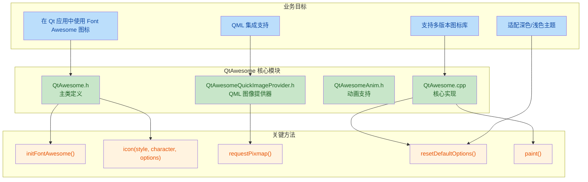
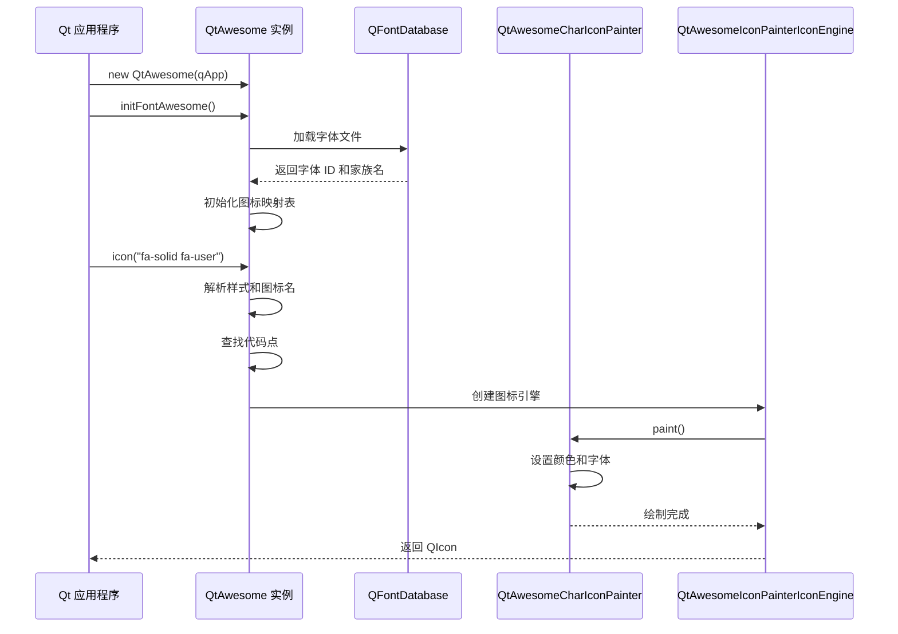

## 1. 高层摘要 (TL;DR)

*   **影响:** **高** - 新增完整的 QtAwesome 第三方库，支持 Font Awesome 7 图标系统
*   **关键变更:**
    *   ✨ 集成 Font Awesome 7，支持 Free、Pro 和 Pro+ 版本
    *   🎨 支持 20+ 种字体样式（Solid、Regular、Light、Thin、Duotone、Sharp 等）
    *   🌓 新增深色/浅色模式自动适配支持（Qt 6.5+）
    *   📱 添加 QML QuickImageProvider 支持，可在 QML 中直接使用图标
    *   🎬 新增图标动画支持

---

## 2. 可视化概览 (代码与逻辑映射)





---

## 3. 详细变更分析

### 📦 组件 1: 核心库架构 (QtAwesome.h / QtAwesome.cpp)

**变更说明:**
新增完整的 QtAwesome 库，提供 Font Awesome 图标在 Qt 中的完整支持。

**关键特性:**

| 特性 | 描述 | 代码位置 |
|------|------|----------|
| **多版本支持** | Free、Pro、Pro+ 三种版本 | QtAwesome.h:26-77 |
| **字体样式枚举** | 20+ 种样式（fa_solid, fa_regular, fa_light, fa_thin, fa_duotone, fa_sharp_* 等） | QtAwesome.h:40-80 |
| **字体数据管理** | QtAwesomeFontData 类管理字体文件、家族名、权重 | QtAwesome.h:97-115 |
| **图标绘制引擎** | QtAwesomeIconPainterIconEngine 自定义 QIconEngine | QtAwesome.cpp:177-213 |
| **选项系统** | 支持颜色、文本、样式等选项，按状态（disabled/active/selected）区分 | QtAwesome.cpp:64-109 |

**代码片段 - 样式枚举定义:**
```cpp
enum fa_styles {
    fa_solid = 0,
    fa_regular = 1,
    fa_brands = 2,
#ifdef FONT_AWESOME_PRO
    fa_light = 3,
    fa_thin = 4,
    fa_duotone_solid = 5,
    fa_sharp_solid = 9,
    // ... 更多样式
#endif
#ifdef FONT_AWESOME_PRO_PLUS
    fa_chisel_regular = 17,
    fa_jelly_regular = 19,
    // ... Pro+ 独有样式
#endif
};
```

---

### 🎨 组件 2: 深色/浅色模式支持

**变更说明:**
新增对 Qt 6.5+ 深色/浅色主题切换的自动适配支持。

**实现机制:**

| 功能 | 实现方式 | 代码位置 |
|------|----------|----------|
| **主题监听** | 连接 QStyleHints::colorSchemeChanged 信号 | QtAwesome.cpp:316-320 |
| **自动重置** | 主题变化时调用 resetDefaultOptions() | QtAwesome.cpp:317-319 |
| **颜色适配** | 从 QPalette 读取当前主题的颜色 | QtAwesome.cpp:326-339 |

**代码片段 - 主题适配:**
```cpp
#ifdef USE_COLOR_SCHEME
    QObject::connect(QApplication::styleHints(), &QStyleHints::colorSchemeChanged, 
        this, [this](Qt::ColorScheme colorScheme){
            Q_UNUSED(colorScheme);
            resetDefaultOptions();
        });
#endif
```

---

### 📱 组件 3: QML 集成支持

**变更说明:**
新增 `QtAwesomeQuickImageProvider`，支持在 QML 中直接使用 Font Awesome 图标。

**使用方式:**

| 步骤 | 操作 | 代码 |
|------|------|------|
| 1 | 注册图像提供器 | `engine.addImageProvider("fa", new QtAwesomeQuickImageProvider(awesome))` |
| 2 | QML 中使用 | `source: "image://fa/solid/user"` |
| 3 | 带参数使用 | `source: "image://fa/solid/beer?color=FFFF77"` |

**代码位置:** 
- 头文件: `QtAwesomeQuickImageProvider.h` (20 行)
- 实现: `QtAwesome.cpp` 的 `requestPixmap()` 方法 (600-631 行)

---

### 🎬 组件 4: 动画支持

**变更说明:**
新增 `QtAwesomeAnimation` 类，支持图标旋转等动画效果。

**功能特性:**

| 属性 | 类型 | 描述 |
|------|------|------|
| `parentWidgetRef_` | QWidget* | 父控件引用 |
| `timer_` | QTimer* | 动画定时器 |
| `interval_` | int | 动画间隔（默认 10ms） |
| `step_` | int | 动画步长（默认 1） |
| `angle_` | float | 当前旋转角度 |

**代码位置:** `QtAwesomeAnim.h` (35 行)

---

### 🔧 组件 5: 构建系统 (CMakeLists.txt)

**变更说明:**
新增完整的 CMake 构建配置，支持 Qt5 和 Qt6。

**构建配置表:**

| 配置项 | 值 | 说明 |
|--------|-----|------|
| **最低 CMake 版本** | 3.16 | 现代构建系统要求 |
| **版本号** | 7.0.0.4 | Font Awesome 7.0.0 + tweak 4 |
| **Qt 版本** | Qt5/Qt6 | 自动检测并适配 |
| **依赖组件** | Core, Widgets, Quick, Qml | 可选 Quick/Qml 支持 |
| **安装路径** | 标准路径 | 遵循 GNUInstallDirs |

**版本检测逻辑:**
```cmake
# 从 Git 标签获取版本，或使用默认版本
if(EXISTS ${CMAKE_CURRENT_SOURCE_DIR}/.git)
  execute_process(COMMAND ${GIT_EXECUTABLE} describe --tags --long --match "font-awesome-*" ...)
  # 解析版本号
endif()
```

---

### 📄 组件 6: 文档与变更日志

**变更说明:**
新增完整的 README.md 和 CHANGES.md 文档。

**README.md 结构:**
- 安装指南（Free/Pro/Pro+ 版本）
- 基本用法示例
- 自定义绘制器示例
- 默认选项说明
- QML 使用指南
- 已知问题和解决方案

**CHANGES.md 关键更新:**
| 日期 | 变更内容 |
|------|----------|
| 2025-11-22 | 更新 GitHub workflow |
| 2025-11-21 | #35, QML QuickImageProvider 支持 |
| 2025-08-28 | #67, 更新到 Font Awesome 7，添加 Pro+ 支持 |
| 2024-04-23 | 支持深色/浅色模式 |
| 2023-02-09 | 添加别名和 Sharp Regular Pro 字体 |

---

## 4. 影响与风险评估

### ✅ 优势
1. **功能完整:** 支持完整的 Font Awesome 7 图标库
2. **跨平台:** 支持 Windows、macOS、Linux
3. **Qt 版本兼容:** 同时支持 Qt5 和 Qt6
4. **主题适配:** 自动适配深色/浅色模式
5. **QML 集成:** 提供完整的 QML 支持

### ⚠️ 风险点

| 风险类型 | 描述 | 缓解措施 |
|----------|------|----------|
| **字体文件依赖** | Pro/Pro+ 版本需要手动放置字体文件到 `QtAwesome/fonts/pro` 目录 | 文档中明确说明安装步骤 |
| **内存管理** | QIcon 可能缓存图标，导致内存泄漏检测误报 | 代码中已有注释说明（QtAwesome.cpp:552-554） |
| **macOS 菜单栏问题** | 在 macOS QMainWindow 菜单中直接使用图标可能不工作 | 提供了 pixmap 转换的解决方案 |
| **Qt 版本要求** | 深色/浅色模式需要 Qt 6.5+ | 使用条件编译 `#ifdef USE_COLOR_SCHEME` |

### 🧪 测试建议

1. **基础功能测试:**
   - 验证 Free 版本图标加载和显示
   - 测试不同样式（Solid、Regular、Brands）的图标

2. **Pro/Pro+ 版本测试:**
   - 验证 Pro 字体文件正确放置
   - 测试 Duotone、Sharp 等 Pro 独有样式

3. **主题适配测试:**
   - 在 Qt 6.5+ 环境下切换深色/浅色模式
   - 验证图标颜色自动更新

4. **QML 集成测试:**
   - 测试 `image://fa/` 图像提供器
   - 验证带参数的图标 URL（如 `?color=FFFF77`）

5. **动画测试:**
   - 测试图标旋转动画
   - 验证动画性能和流畅度

6. **跨平台测试:**
   - Windows: 验证字体加载和图标显示
   - macOS: 测试菜单栏图标（使用 pixmap 转换方案）
   - Linux: 验证字体渲染效果

---

## 5. 总结

本次变更新增了完整的 **QtAwesome** 库，这是一个功能强大的 Font Awesome 图标集成方案。该库提供了：

- 🎨 **20+ 种字体样式**支持（包括 Free、Pro、Pro+）
- 🌓 **自动主题适配**（深色/浅色模式）
- 📱 **完整的 QML 集成**
- 🎬 **图标动画支持**
- 🔧 **灵活的选项系统**（颜色、文本、样式等按状态配置）

该库代码质量良好，文档完善，适合在 Qt 项目中集成使用。建议在集成后进行充分的跨平台测试，特别是 Pro/Pro+ 版本的字体文件配置和主题切换功能。