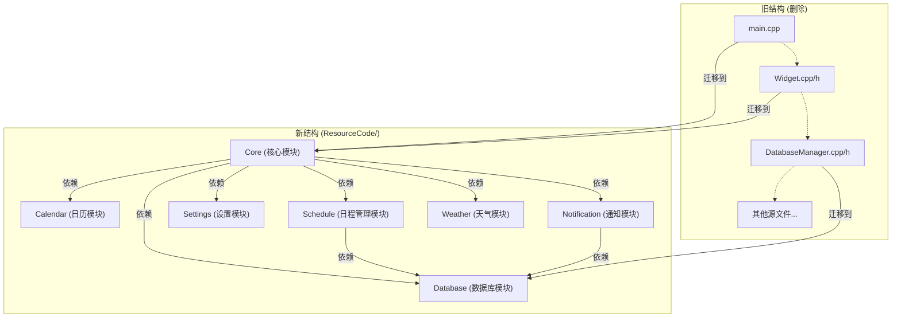
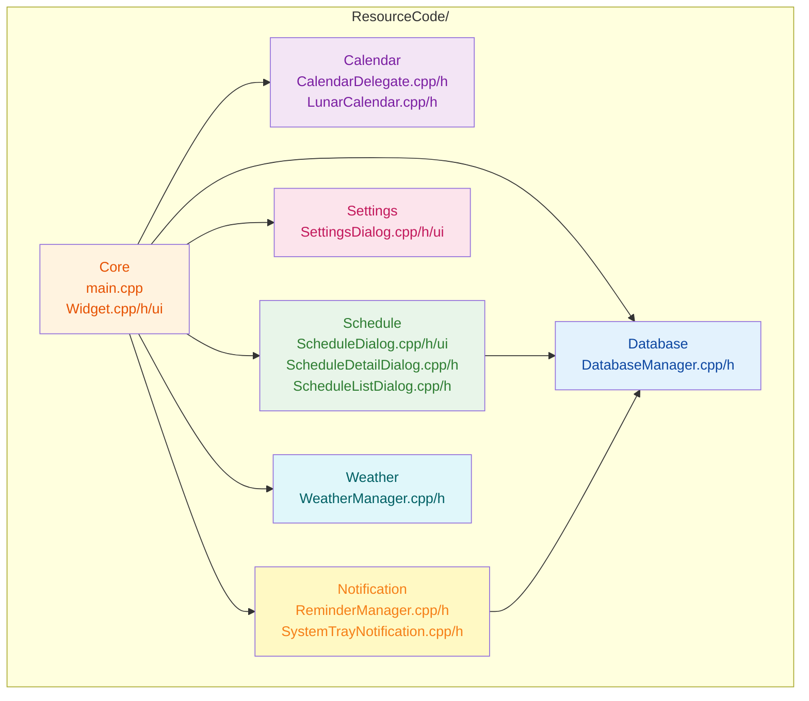

## 1. 高层摘要 (TL;DR)

**影响**: **High** - 重大架构重构，将整个项目从扁平结构转换为模块化架构

**关键变更**:
- 🏗️ **项目重构**: 所有源代码从根目录移动到 `ResourceCode/` 下的模块化目录结构（Core, Database, Calendar, Schedule, Settings, Notification, Weather）
- 🔧 **构建系统更新**: CMakeLists.txt 完全重写，适配新的目录结构，添加 libcurl 链接和 Qt6 Quick/Qml 模块
- 📝 **文档完善**: 新增模块划分说明文档和 IMAP/SMTP 邮件功能集成开发指导文档
- 🛠️ **构建工具**: 新增 MSYS2 构建脚本，优化 MinGW 编译环境
- 🗑️ **清理**: 删除根目录旧源文件和调试文档

---

## 2. 视觉概览 (代码与逻辑映射)

### 2.1 项目结构重构图



### 2.2 CMake 构建流程


### 2.3 模块依赖关系



---

## 3. 详细变更分析

### 3.1 🏗️ 项目结构重构

#### 变更说明
将所有源代码从根目录移动到 `ResourceCode/` 下的模块化目录，按功能职责划分。

#### 新旧路径对照表

| 原路径 | 新路径 | 模块 |
|--------|--------|------|
| `main.cpp` | `ResourceCode/Core/main.cpp` | Core |
| `Widget.cpp/h/ui` | `ResourceCode/Core/Widget.cpp/h/ui` | Core |
| `DatabaseManager.cpp/h` | `ResourceCode/Database/DatabaseManager.cpp/h` | Database |
| `CalendarDelegate.cpp/h` | `ResourceCode/Calendar/CalendarDelegate.cpp/h` | Calendar |
| `LunarCalendar.cpp/h` | `ResourceCode/Calendar/LunarCalendar.cpp/h` | Calendar |
| `ScheduleDialog.cpp/h/ui` | `ResourceCode/Schedule/ScheduleDialog.cpp/h/ui` | Schedule |
| `ScheduleDetailDialog.cpp/h` | `ResourceCode/Schedule/ScheduleDetailDialog.cpp/h` | Schedule |
| `ScheduleListDialog.cpp/h` | `ResourceCode/Schedule/ScheduleListDialog.cpp/h` | Schedule |
| `SettingsDialog.cpp/h/ui` | `ResourceCode/Settings/SettingsDialog.cpp/h/ui` | Settings |
| `ReminderManager.cpp/h` | `ResourceCode/Notification/ReminderManager.cpp/h` | Notification |
| `SystemTrayNotification.cpp/h` | `ResourceCode/Notification/SystemTrayNotification.cpp/h` | Notification |
| `WeatherManager.cpp/h` | `ResourceCode/Weather/WeatherManager.cpp/h` | Weather |

#### 新增文档

**文件**: `ResourceCode/模块划分说明.md`

- 详细说明 7 个模块的功能职责
- 提供模块依赖关系图
- 包含编译说明和扩展建议

**文件**: `doc/IMAP_SMTP集成开发指导文档.md`

- 3266 行完整的邮件功能集成开发指南
- 包含 libcurl 库安装配置
- IMAP/SMTP 协议实现示例
- 错误处理机制设计
- 安全注意事项

### 3.2 🔧 CMakeLists.txt 重构

#### 变更说明
完全重写 CMakeLists.txt 以适配新的模块化结构。

#### 配置变更表

| 配置项 | 旧值 | 新值 | 说明 |
|--------|------|------|------|
| Qt 版本检测 | `find_package(QT NAMES Qt6 Qt5 REQUIRED COMPONENTS Widgets Sql Network)` | `find_package(Qt6 REQUIRED COMPONENTS Widgets Sql Network Quick Qml)` | 移除 Qt5 支持，直接使用 Qt6 |
| 源文件路径 | 根目录下的文件列表 | `ResourceCode/模块名/文件名` | 所有路径更新 |
| Include 路径 | `${CMAKE_CURRENT_SOURCE_DIR}/lib/QtAwesome` | 为每个模块添加独立 include 路径 | 模块化编译 |
| 链接库 | `Qt${QT_VERSION_MAJOR}::Widgets/Sql/Network` | `Qt6::Widgets/Sql/Network/Quick/Qml` | 添加 Qt6 Quick/Qml |
| 外部库 | `winmm.lib` (条件) | `libcurl.a`, `ws2_32`, `wldap32`, `winmm.lib` | 添加 libcurl 和网络库 |

#### 关键代码变更

**源文件列表** (Source: `CMakeLists.txt:15-54`)
```cmake
set(PROJECT_SOURCES
    ResourceCode/Core/main.cpp
    ResourceCode/Core/Widget.cpp
    ResourceCode/Core/Widget.h
    ResourceCode/Core/Widget.ui
    ResourceCode/Database/DatabaseManager.cpp
    ResourceCode/Database/DatabaseManager.h
    ResourceCode/Schedule/ScheduleDialog.cpp
    # ... 其他模块文件
)
```

**Include 路径配置** (Source: `CMakeLists.txt:47-57`)
```cmake
target_include_directories(PersonalDateAssisant PRIVATE
    "C:/CodeSpace/Objects/QTObj/PersonalDateAssisant/DataAssistant/ResourceCode"
    "C:/CodeSpace/Objects/QTObj/PersonalDateAssisant/DataAssistant/ResourceCode/Core"
    "C:/CodeSpace/Objects/QTObj/PersonalDateAssisant/DataAssistant/ResourceCode/Database"
    # ... 其他模块路径
)
```

**链接库配置** (Source: `CMakeLists.txt:59-70`)
```cmake
target_link_libraries(PersonalDateAssisant PRIVATE
    Qt6::Widgets
    Qt6::Sql
    Qt6::Network
    Qt6::Quick
    Qt6::Qml
    QtAwesome
    "C:/CodeSpace/Compile/Mysy2/ucrt64/lib/libcurl.a"
    ws2_32
    wldap32
    winmm.lib
)
```

### 3.3 🛠️ 构建工具新增

#### 新增文件: `scripts/build_msys2.bat`

**功能**: MSYS2 环境下的自动化构建脚本

**关键特性**:
- 自动配置 GCC 编译器路径
- 三步构建流程：清理 → 配置 → 编译
- 支持多线程编译 (`-j4`)
- 错误处理和状态提示

**脚本结构**:
```batch
[1]  设置项目变量和路径
[2]  配置 MSYS2 环境和 PATH
[3]  检查 GCC 版本
[4]  清理构建目录
[5]  运行 CMake 配置
[6]  执行 mingw32-make 编译
[7]  输出可执行文件位置
```

### 3.4 🔧 QtAwesome 编译优化

**文件**: `lib/QtAwesome/CMakeLists.txt`

**变更**: 为 MinGW 编译器添加编译选项

```cmake
if(MINGW)
    set(CMAKE_CXX_FLAGS "${CMAKE_CXX_FLAGS} -Wno-ignored-attributes")
    add_compile_options(-Wno-ignored-attributes)
endif()
```

**说明**: 解决 MinGW 编译器对某些属性的警告问题。

### 3.5 🗑️ 文件清理

**删除文件**:
- `main.cpp` (已迁移到 `ResourceCode/Core/`)
- `Widget.cpp/h` (已迁移到 `ResourceCode/Core/`)
- `DatabaseManager.cpp/h` (已迁移到 `ResourceCode/Database/`)
- 其他所有根目录源文件
- `debug_delete_issue.md` (调试文档)

---

## 4. 影响与风险评估

### 4.1 ⚠️ 破坏性变更

| 变更类型 | 影响 | 缓解措施 |
|---------|------|---------|
| **文件路径变更** | 所有源文件路径改变 | 更新 CMakeLists.txt 已完成 |
| **Qt 版本锁定** | 移除 Qt5 支持，仅支持 Qt6 | 确保开发环境使用 Qt6 |
| **构建依赖** | 新增 libcurl 依赖 | 需要安装 libcurl 库 |
| **绝对路径** | CMakeLists.txt 使用绝对路径 | 可能影响跨平台编译 |

### 4.2 ✅ 测试建议

**编译测试**:
- [ ] 在 MSYS2 环境下运行 `scripts/build_msys2.bat`
- [ ] 验证所有模块正确编译
- [ ] 检查 libcurl 链接是否成功

**功能测试**:
- [ ] 启动应用程序，验证主窗口正常显示
- [ ] 测试日程管理功能（添加、编辑、删除）
- [ ] 测试日历显示和农历功能
- [ ] 测试天气功能（需要网络）
- [ ] 测试系统托盘通知

**模块测试**:
- [ ] 验证数据库连接和操作
- [ ] 验证日历委托渲染
- [ ] 验证提醒管理器
- [ ] 验证设置对话框

### 4.3 📋 迁移检查清单

**开发环境准备**:
- [ ] 安装 Qt6 开发环境
- [ ] 安装 libcurl 库（MSYS2: `pacman -S mingw-w64-ucrt-x86_64-curl`）
- [ ] 配置 CMake (版本 3.16+)
- [ ] 配置 MinGW 或 MSVC 编译器

**代码适配**:
- [ ] 更新 IDE 项目文件（如果使用 Qt Creator）
- [ ] 更新所有头文件包含路径
- [ ] 验证跨模块依赖关系

**文档更新**:
- [ ] 更新 README.md 构建说明
- [ ] 更新开发文档中的文件路径引用

---

## 5. 总结

本次变更是一次**重大的项目架构重构**，主要目标是：

1. **模块化**: 将扁平的源文件结构按功能职责划分为 7 个独立模块
2. **现代化**: 升级到 Qt6，移除 Qt5 支持
3. **扩展性**: 添加 Qt6 Quick/Qml 模块，为未来 UI 现代化做准备
4. **功能增强**: 集成 libcurl，为邮件功能提供基础
5. **文档完善**: 新增模块划分说明和邮件功能集成文档

**优点**:
- ✅ 代码组织更清晰，易于维护
- ✅ 模块职责明确，降低耦合
- ✅ 构建配置标准化
- ✅ 为未来功能扩展提供基础

**风险**:
- ⚠️ 绝对路径影响跨平台编译
- ⚠️ libcurl 依赖增加构建复杂度
- ⚠️ 需要更新所有开发者的开发环境

**建议**:
1. 优先测试编译和基本功能
2. 考虑将绝对路径改为相对路径
3. 为 libcurl 添加 CMake find_package 支持
4. 更新 CI/CD 配置（如果存在）