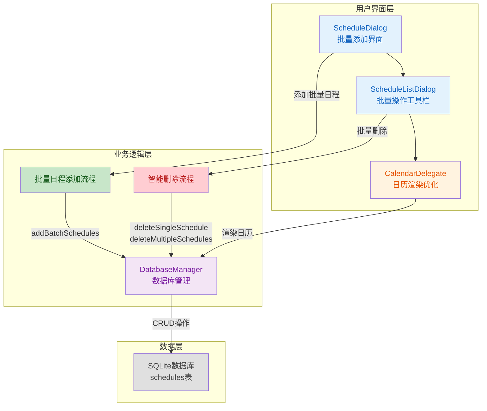
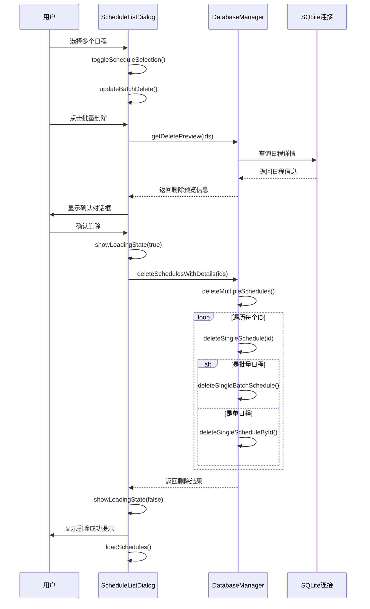

## 1. 高层摘要 (TL;DR)

*   **影响范围:** 🟢 **高** - 实现了完整的批量日程管理系统,包括批量添加、智能删除和UI优化
*   **核心变更:**
    *   ✨ 新增批量日程添加功能(支持最多30天)
    *   🗑️ 实现智能批量删除体系(支持单日程/批量日程识别)
    *   🎨 优化日历显示样式(过去日期、周末颜色)
    *   📋 增强日程列表UI(批量操作工具栏、复选框选择)

---

## 2. 可视化概览 (代码与逻辑映射)



### 批量删除逻辑流程



---

## 3. 详细变更分析

### 📅 **组件一: 日历显示优化**

**变更文件:** `CalendarDelegate.cpp`

**变更内容:**
- **新增过去日期识别:** 添加 `isPastDate` 标志,区分当月已过去的日期
- **优化背景色逻辑:**
  - 今天: 白色背景(无日程)或优先级颜色(有日程)
  - 过去日期: 浅灰色背景(无日程)或优先级颜色(有日程)
  - 非当月: 深灰色背景
  - 未来日期: 白色背景(无日程)或优先级颜色(有日程)
- **周末颜色增强:** 周末文字颜色从 `#C83232` 改为更鲜艳的 `#FF0000`

**代码片段:**
```cpp
bool isPastDate = isCurrentMonth && (date < m_today) && !isToday;
int dayOfWeek = date.dayOfWeek();

// 周末日期：红色字体 #FF0000
if (dayOfWeek == 6 || dayOfWeek == 7) {
    painter->setPen(QColor(255, 0, 0));
}
```

---

### 💾 **组件二: 数据库管理器重构**

**变更文件:** `DatabaseManager.h`, `DatabaseManager.cpp`

#### 2.1 数据结构扩展

**新增字段:**

| 字段名 | 类型 | 说明 |
|--------|------|------|
| `endDatetime` | TEXT | 批量日程的结束日期时间 |
| `isBatch` | INTEGER | 是否为批量日程(0=否, 1=是) |

**新增结构体:**
```cpp
struct DeleteResult {
    int totalSchedules;      // 将要/实际删除的日程总数
    int batchCount;         // 涉及的批量日程批次数
    int batchDaysCount;     // 涉及的批量日程总天数
    int scheduleCount;      // 涉及的普通日程数
    int actualDeleted;      // 实际删除的日程数
    QStringList batchDetails; // 每个批量日程的详细信息
};
```

#### 2.2 数据库连接优化

**变更内容:**
- 实现单例模式数据库连接,避免重复创建连接
- 使用静态变量 `sharedDb` 和 `dbInitialized` 管理连接状态

**代码片段:**
```cpp
static QSqlDatabase sharedDb;
static bool dbInitialized = false;

QSqlDatabase DatabaseManager::getDatabaseConnection(const QString& connectionName) {
    if (!dbInitialized) {
        sharedDb = QSqlDatabase::addDatabase("QSQLITE");
        sharedDb.setDatabaseName(QStandardPaths::writableLocation(QStandardPaths::AppDataLocation) + "/schedules.db");
        sharedDb.open();
        dbInitialized = true;
    }
    return sharedDb;
}
```

#### 2.3 批量添加功能

**新增方法:**
- `addBatchSchedules(const QVector<Schedule>& schedules)` - 批量添加日程,使用事务保证原子性

#### 2.4 智能删除体系

**删除函数层级:**

| 函数名 | 功能 | 调用关系 |
|--------|------|----------|
| `deleteSingleScheduleById(int id)` | 删除单个日程 | 基础函数 |
| `deleteSingleBatchSchedule(...)` | 删除整个批量日程 | 基础函数 |
| `deleteSingleSchedule(int id)` | 智能判断并删除 | 调用上述两个函数 |
| `deleteMultipleSchedules(const QVector<int>& ids)` | 批量删除多个 | 循环调用 `deleteSingleSchedule` |
| `getDeletePreview(const QVector<int>& ids)` | 获取删除预览 | 独立函数 |
| `deleteSchedulesWithDetails(const QVector<int>& ids)` | 带详情的删除 | 调用预览和批量删除 |
| `deleteAllSchedules()` | 清空所有日程 | 独立函数 |

**关键逻辑:**
```cpp
bool DatabaseManager::deleteSingleSchedule(int id) {
    // 查询日程信息
    QSqlQuery query;
    query.prepare("SELECT isBatch, title, datetime, endDatetime, priority FROM schedules WHERE id = ?");
    
    if (query.exec() && query.next()) {
        bool isBatch = query.value(0).toInt() == 1;
        // ... 获取其他字段
        
        if (isBatch) {
            return deleteSingleBatchSchedule(title, datetime, endDatetime, priority);
        } else {
            return deleteSingleScheduleById(id);
        }
    }
}
```

#### 2.5 查询逻辑优化

**变更内容:**
- 使用列名代替索引,避免字段顺序问题
- 支持批量日程的合并查询
- 优化日期范围查询逻辑

**代码片段:**
```cpp
// 使用列名代替索引
schedule.id = query.value("id").toInt();
schedule.title = query.value("title").toString();
schedule.datetime = QDateTime::fromString(query.value("datetime").toString(), Qt::ISODate);

// 读取批量添加字段
QString endDatetimeStr = query.value("endDatetime").toString();
schedule.endDatetime = endDatetimeStr.isEmpty() ? schedule.datetime : QDateTime::fromString(endDatetimeStr, Qt::ISODate);
schedule.isBatch = query.value("isBatch").toInt() == 1;
```

---

### 📝 **组件三: 日程对话框增强**

**变更文件:** `ScheduleDialog.h`, `ScheduleDialog.cpp`, `ScheduleDialog.ui`

#### 3.1 UI变更

**新增控件:**

| 控件名 | 类型 | 说明 |
|--------|------|------|
| `batchAddCheckBox` | QCheckBox | 批量添加复选框 |
| `dateRangeFrame` | QFrame | 日期范围容器 |
| `startDateTimeEdit` | QDateTimeEdit | 开始日期时间 |
| `endDateTimeEdit` | QDateTimeEdit | 结束日期时间 |

**界面尺寸调整:**
- 宽度: 400px → 450px
- 高度: 350px → 420px

#### 3.2 批量添加逻辑

**验证规则:**
1. ✅ 结束日期必须 ≥ 开始日期
2. ✅ 日期范围不能超过30天

**代码片段:**
```cpp
bool ScheduleDialog::validateBatchDates() {
    QDateTime startDate = ui->startDateTimeEdit->dateTime();
    QDateTime endDate = ui->endDateTimeEdit->dateTime();
    
    // 验证：结束日期必须晚于或等于开始日期
    if (endDate < startDate) {
        QMessageBox::warning(this, "日期错误", "结束日期必须晚于或等于开始日期");
        return false;
    }
    
    // 验证：日期范围不能超过30天
    int days = getDaysInRange(startDate, endDate);
    if (days > 30) {
        QMessageBox::warning(this, "日期范围过大", 
            QString("单次批量添加不能超过30天，当前选择为 %1 天\n请缩短日期范围后重试").arg(days));
        return false;
    }
    
    return true;
}
```

---

### 📋 **组件四: 日程列表对话框升级**

**变更文件:** `ScheduleListDialog.h`, `ScheduleListDialog.cpp`

#### 4.1 批量操作工具栏

**新增控件:**

| 控件名 | 功能 | 样式 |
|--------|------|------|
| `m_selectAll` | 全选按钮 | 蓝色背景 (#4A90E2) |
| `m_deselectAll` | 取消全选 | 灰色背景 (#F0F2F5) |
| `m_selectionCountLabel` | 选中数量标签 | 深灰色文字 |
| `m_batchDelete` | 批量删除按钮 | 红色背景 (#DC3545) |
| `deleteAll` | 清空所有按钮 | 灰色背景 (#6C757D) |

#### 4.2 日程项卡片增强

**新增功能:**
- ✅ 每个日程项添加复选框
- 📅 批量日程显示日期范围和"📅 批量"标签
- 🎨 选中状态高亮显示(浅蓝色背景)
- 📏 批量日程卡片宽度增加(70px → 150px)

**样式对比:**

| 类型 | 边框样式 | 背景色 |
|------|----------|--------|
| 普通日程 | 无边框 | 白色 |
| 批量日程 | 2px 蓝色边框 (#4A90E2) | 白色 |
| 选中状态 | 2px 蓝色边框 | 浅蓝色 (#E8F4FD) |

#### 4.3 批量删除流程

**步骤:**
1. 用户选择多个日程
2. 点击"批量删除"按钮
3. 调用 `getDeletePreview()` 获取删除预览
4. 显示确认对话框(包含详细统计信息)
5. 显示加载状态覆盖层
6. 执行删除操作
7. 显示删除结果反馈
8. 刷新列表

**预览信息示例:**
```
📊 共计: 15 个日程
📅 批量日程: 2 批（共 12 天）
📝 普通日程: 3 个

批量日程详情：
  • 每日会议 (5 天, 01/15 至 01/19)
  • 健身计划 (7 天, 01/20 至 01/26)

⚠️ 此操作不可撤销！
```

#### 4.4 加载状态覆盖层

**功能:**
- 半透明黑色背景 (rgba(0, 0, 0, 0.5))
- 白色提示框,显示"正在删除 X 个日程..."
- 禁用主窗口,防止用户操作

---

## 4. 影响与风险评估

### ⚠️ **破坏性变更**

| 变更项 | 影响范围 | 兼容性处理 |
|--------|----------|------------|
| 数据库表结构 | 新增 `endDatetime`, `isBatch` 字段 | ✅ 使用 `ALTER TABLE` 向后兼容 |
| 删除函数签名 | `deleteSchedule()` → `deleteSingleSchedule()` | ✅ 保留原函数,新增新函数 |
| UI布局 | 日程对话框尺寸增大 | ⚠️ 可能影响布局适配 |

### 🧪 **测试建议**

#### 功能测试
1. **批量添加功能:**
   - ✅ 测试添加1天、7天、30天的批量日程
   - ✅ 验证结束日期 < 开始日期时的错误提示
   - ✅ 验证超过30天时的错误提示
   - ✅ 检查批量日程在日历中的显示

2. **批量删除功能:**
   - ✅ 测试删除单个普通日程
   - ✅ 测试删除单个批量日程(验证整个批次被删除)
   - ✅ 测试混合删除(普通+批量)
   - ✅ 测试全选/取消全选功能
   - ✅ 测试清空所有日程功能

3. **日历显示:**
   - ✅ 验证过去日期的灰色背景
   - ✅ 验证周末的红色文字
   - ✅ 验证今天的高亮显示
   - ✅ 验证优先级颜色显示

#### 边界测试
- ⚠️ 测试空数据库情况下的批量操作
- ⚠️ 测试大量批量日程(如10个批次,每个30天)的性能
- ⚠️ 测试并发删除操作

#### 回归测试
- ✅ 验证原有单日程添加/编辑/删除功能正常
- ✅ 验证日程提醒功能未受影响
- ✅ 验证数据备份/恢复功能正常

### 📊 **性能影响**

| 操作 | 优化前 | 优化后 | 说明 |
|------|--------|--------|------|
| 数据库连接 | 每次操作创建新连接 | 单例共享连接 | ✅ 减少连接开销 |
| 批量添加 | 循环调用单次添加 | 事务批量插入 | ✅ 显著提升性能 |
| 批量删除 | 循环调用单次删除 | 智能批量删除 | ✅ 减少数据库查询 |

---

## 5. 总结

本次更新实现了完整的批量日程管理系统,主要包括:

1. **✨ 批量添加:** 支持一次性添加最多30天的重复日程
2. **🗑️ 智能删除:** 自动识别单日程/批量日程,提供详细的删除预览
3. **🎨 UI优化:** 日历显示更清晰,列表操作更便捷
4. **💾 数据库优化:** 单例连接模式,事务支持,向后兼容

**建议优先级:**
- 🔴 **高优先级:** 测试批量删除功能,确保数据完整性
- 🟡 **中优先级:** 验证UI在不同屏幕尺寸下的显示效果
- 🟢 **低优先级:** 优化批量操作的动画效果