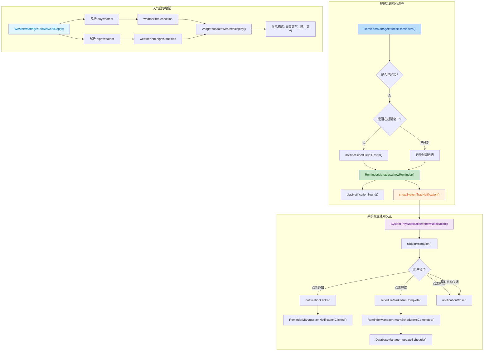

## 1. 高层摘要 (TL;DR)

*   **影响范围**: **高** - 核心提醒系统全面重构，新增系统托盘通知组件
*   **关键变更**:
    *   ✨ 新增 `SystemTrayNotification` 类，实现优雅的桌面通知弹窗
    *   🔔 提醒系统从 `QMessageBox` 对话框升级为非阻塞式系统托盘通知
    *   🔊 添加 Windows 系统提示音支持
    *   🌤️ 天气显示增强，同时展示白天和夜间天气
    *   ⌨️ 新增 `Ctrl+T` 快捷键测试通知功能

---

## 2. 可视化概览 (代码与逻辑映射)



---

## 3. 详细变更分析

### 🎯 核心组件：提醒系统重构

**组件名称**: `ReminderManager` (ReminderManager.cpp/h)

**变更说明**:
-   **通知方式升级**: 从阻塞式 `QMessageBox` 对话框改为非阻塞式系统托盘通知，用户体验显著提升
-   **提醒频率优化**: 检查间隔从 60 秒缩短至 10 秒，确保提醒更及时
-   **去重机制**: 新增 `notifiedScheduleIds` 集合，避免同一日程重复提醒
-   **提醒窗口扩大**: 从 1 分钟窗口扩大至 5 分钟，并支持过期提醒（超过 5 分钟但未到日程时间）

**新增方法**:

| 方法名 | 功能描述 | 调用时机 |
|--------|----------|----------|
| `markScheduleAsCompleted(int)` | 标记日程为已完成 | 用户点击"完成"按钮 |
| `testNotification()` | 触发测试通知 | 按 `Ctrl+T` 快捷键 |
| `playNotificationSound()` | 播放系统提示音 | 显示通知时 |
| `showSystemTrayNotification()` | 显示系统托盘通知 | 到达提醒时间 |
| `onNotificationClicked(int)` | 处理通知点击事件 | 用户点击通知 |
| `onNotificationClosed()` | 处理通知关闭事件 | 用户关闭或超时 |
| `cleanupNotification(int)` | 清理通知资源 | 通知关闭后 |

**新增信号**:
-   `scheduleClicked(int scheduleId)` - 通知被点击时触发
-   `scheduleCompleted(int scheduleId)` - 日程标记为完成时触发

---

### 🖼️ 新增组件：系统托盘通知

**组件名称**: `SystemTrayNotification` (SystemTrayNotification.cpp/h)

**变更说明**:
-   **全新组件**: 实现现代化的桌面通知弹窗，支持动画效果和用户交互
-   **动画系统**: 使用 `QPropertyAnimation` 实现滑入/滑出动画，动画时长 300ms
-   **自动关闭**: 6 秒后自动关闭通知
-   **交互功能**: 支持点击查看详情、标记完成、手动关闭

**通知界面元素**:
```
┌─────────────────────────────────────┐
│ 🔔 日程提醒              ×          │
│                                     │
│ 📋 日程标题                         │
│ 时间：2024-01-01 10:00              │
│ 内容：日程描述                      │
│ 💡 点击查看详情                     │
│                              [✓ 完成]│
└─────────────────────────────────────┘
```

**动画效果配置**:

| 配置项 | 值 | 说明 |
|--------|-----|------|
| 动画时长 | 300ms | 滑入/滑出动画时间 |
| 自动关闭时长 | 6000ms | 通知显示后自动关闭时间 |
| 缓动曲线 | OutCubic / InCubic | 滑入/滑出使用不同的缓动效果 |
| 位置 | 屏幕右下角 | 距离边缘 20px |

---

### 🌤️ 天气显示增强

**组件名称**: `WeatherManager` (WeatherManager.cpp/h) & `Widget` (Widget.cpp/h)

**变更说明**:
-   **新增夜间天气**: 在 `WeatherInfo` 结构体中添加 `nightCondition` 字段
-   **显示格式优化**: 同时显示白天和夜间天气，格式为 `"白天天气 - 晚上天气"`
-   **预报格式更新**: 未来三日预报格式从 `"周一 🌤 晴 18~25°C"` 改为 `"周一 🌤 晴 - 🌧️ 小雨 18~25°C"`

**数据结构变更**:

| 字段 | 类型 | 说明 |
|------|------|------|
| `nightCondition` | `QString` | 新增：夜间天气描述，如 `"🌧️ 小雨"` |
| `forecast[3]` | `QString[]` | 更新：格式包含白天和夜间天气 |

**代码示例** (WeatherManager.cpp):
```cpp
// 填充预报数据（明天、后天、大后天），格式："周一 🌤 晴 - 🌧️ 小雨 18~25°C"
weatherInfo.forecast[forecastIndex] = QString("%1 %2 - %3 %4~%5°C")
    .arg(weekDay)
    .arg(weatherToEmoji(dayWeather))
    .arg(weatherToEmoji(nightWeather))
    .arg(nightTemp)
    .arg(dayTemp);
```

---

### ⚙️ 构建配置更新

**文件**: CMakeLists.txt

**新增源文件**:
-   `SystemTrayNotification.cpp`
-   `SystemTrayNotification.h`

**新增依赖库**:
| 库名 | 平台 | 用途 |
|------|------|------|
| `winmm.lib` | Windows | Windows 多媒体库，用于播放系统提示音 |

---

### ⌨️ 快捷键支持

**文件**: Widget.cpp/h

**新增快捷键**:
-   `Ctrl+T`: 触发测试通知，用于验证提醒功能是否正常工作

**实现代码** (Widget.cpp):
```cpp
void Widget::keyPressEvent(QKeyEvent *event) {
    if (event->modifiers() == Qt::ControlModifier && event->key() == Qt::Key_T) {
        qDebug() << "Ctrl+T pressed - showing test notification";
        reminderManager->testNotification();
        event->accept();
    } else {
        QWidget::keyPressEvent(event);
    }
}
```

---

## 4. 影响与风险评估

### ⚠️ 破坏性变更

| 变更项 | 影响范围 | 风险等级 | 说明 |
|--------|----------|----------|------|
| 提醒系统重构 | 所有提醒功能 | 🟡 中等 | 从阻塞式对话框改为非阻塞通知，用户交互方式改变 |
| 天气显示格式 | 天气显示区域 | 🟢 低 | 仅影响显示格式，数据结构向后兼容 |

### ✅ 测试建议

**提醒系统测试**:
1.  **基本提醒**: 创建一个 5 分钟后的日程，验证是否在正确时间弹出通知
2.  **去重机制**: 创建一个日程，等待提醒弹出后，验证不会重复弹出
3.  **过期提醒**: 创建一个已过期的提醒时间（但未到日程时间），验证是否仍能收到通知
4.  **完成功能**: 点击通知中的"完成"按钮，验证日程是否被标记为已完成
5.  **声音播放**: 验证通知弹出时是否播放系统提示音
6.  **快捷键测试**: 按 `Ctrl+T` 验证测试通知是否正常显示

**天气显示测试**:
1.  **白天/夜间天气**: 验证天气显示是否同时包含白天和夜间天气
2.  **预报格式**: 验证未来三日预报格式是否正确

**跨平台测试**:
-   Windows: 验证 `PlaySound()` 和 `MessageBeep()` 是否正常工作
-   macOS: 验证 `QSystemSound::playAlertSound()` 是否正常工作
-   Linux: 验证 `QApplication::beep()` 是否正常工作

### 📊 性能影响

| 指标 | 变化 | 说明 |
|------|------|------|
| 提醒检查频率 | 60s → 10s | 更频繁的检查，但 CPU 影响极小 |
| 内存占用 | 略增 | 新增 `SystemTrayNotification` 实例 |
| 用户体验 | ⬆️ 显著提升 | 非阻塞通知，不影响用户操作 |

---

## 5. 总结

本次变更实现了提醒系统的现代化升级，从传统的阻塞式对话框改为优雅的系统托盘通知，大幅提升了用户体验。同时增强了天气显示功能，提供更详细的天气信息。新增的测试快捷键和完善的错误处理机制也提高了系统的可维护性和可靠性。

**关键亮点**:
-   🎨 现代化的 UI 设计，支持动画效果
-   🔔 非阻塞式通知，不干扰用户操作
-   🛡️ 完善的异常处理和资源清理机制
-   🎯 更精准的提醒窗口和去重逻辑