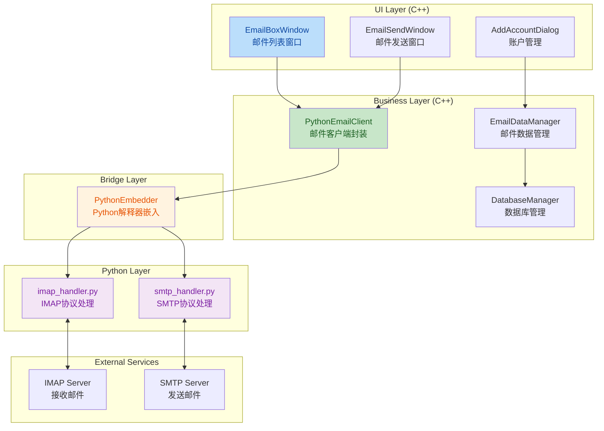
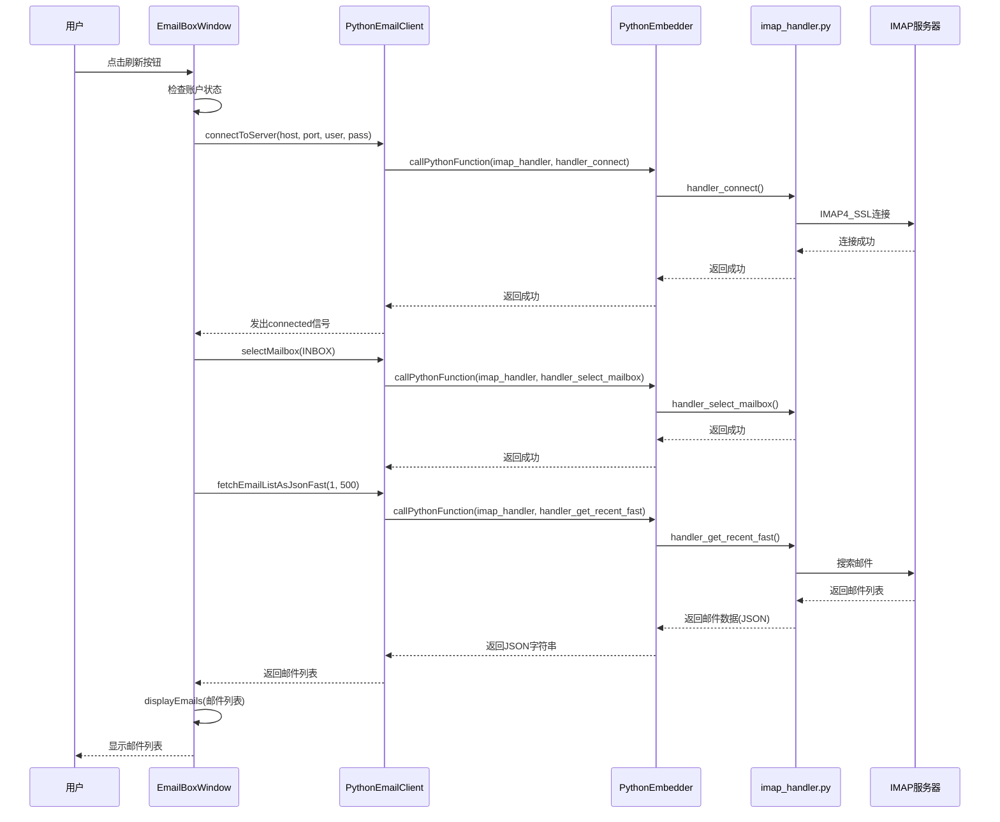

## 1. 高层摘要 (TL;DR)

*   **影响范围**: 🔴 **高** - 新增完整的邮件客户端功能模块,涉及C++/Python混合编程
*   **核心变更**:
    *   ✨ 新增 **Python邮件处理模块** (IMAP/SMTP协议支持)
    *   ✨ 新增 **邮件UI组件** (邮件列表、发送、账户管理)
    *   ⚙️ 更新 **CMake构建配置** (集成Python 3.14)
    *   🔧 集成 **Python解释器嵌入** (C++调用Python代码)

---

## 2. 可视化架构图

### 2.1 邮件模块架构流程图



### 2.2 邮件刷新流程序列图



---

## 3. 详细变更分析

### 3.1 Python邮件处理模块 (PythonEmail/)

#### 3.1.1 PythonEmailClient (C++封装层)

**文件**: `PythonEmailClient.cpp`, `PythonEmailClient.h`

**功能概述**: C++类,封装Python邮件处理功能,提供Qt信号槽接口

**核心方法**:

| 方法名 | 功能 | Python对应函数 |
|--------|------|----------------|
| `connectToServer()` | 连接IMAP服务器 | `imap_handler.handler_connect()` |
| `selectMailbox()` | 选择邮箱 | `imap_handler.handler_select_mailbox()` |
| `fetchEmailListAsJsonFast()` | 获取邮件列表(快速) | `imap_handler.handler_get_recent_fast()` |
| `fetchEmailBody()` | 获取邮件正文 | `imap_handler.handler_fetch_body()` |
| `sendEmail()` | 发送邮件 | `smtp_handler.handler_send_email()` |
| `deleteEmail()` | 删除邮件 | `imap_handler.handler_delete()` |

**关键代码片段**:
```cpp
// 连接服务器并认证
bool PythonEmailClient::connectToServer(const QString& host, quint16 port, 
                                        const QString& username, 
                                        const QString& password, bool useSsl) {
    // 创建IMAP处理器
    QVariant result = PythonEmbedder::instance().callPythonFunction(
        "imap_handler", "create_handler", QVariantList());
    m_imapHandlerId = result.toInt();
    
    // 调用Python连接函数
    QVariantList args;
    args.append(m_imapHandlerId);
    args.append(host);
    args.append(static_cast<int>(port));
    args.append(username);
    args.append(password);
    
    result = PythonEmbedder::instance().callPythonFunction(
        "imap_handler", "handler_connect", args);
    
    // 处理返回结果
    if (result.canConvert<QVariantList>()) {
        QVariantList resultList = result.toList();
        bool success = resultList[0].toBool();
        if (success) {
            m_state = ConnectionState::Authenticated;
            emit connected();
            return true;
        }
    }
    return false;
}
```

#### 3.1.2 PythonEmbedder (Python解释器嵌入)

**文件**: `PythonEmbedder.cpp`, `PythonEmbedder.h`

**功能概述**: 单例类,管理Python解释器的初始化、关闭和函数调用

**关键特性**:
- ✅ 自动查找Python模块路径
- ✅ QVariant与Python对象双向转换
- ✅ GIL(全局解释器锁)管理
- ✅ 详细的日志记录

**初始化流程**:
```cpp
bool PythonEmbedder::initialize() {
    // 1. 设置Python路径
    setPythonPath();
    
    // 2. 配置环境变量
    qputenv("PYTHONHOME", "C:/Users/32660/AppData/Local/Python/pythoncore-3.14-64");
    qputenv("PYTHONPATH", "C:/Users/32660/AppData/Local/Python/pythoncore-3.14-64/Lib");
    
    // 3. 初始化Python解释器
    Py_Initialize();
    
    // 4. 添加PythonEmail模块到sys.path
    PyObject* sysPath = PySys_GetObject("path");
    PyList_Insert(sysPath, 0, pathStr);
    
    m_initialized = true;
    emit initialized();
    return true;
}
```

#### 3.1.3 IMAP处理器 (Python)

**文件**: `imap_handler.py`

**功能概述**: 使用Python标准库`imaplib`实现IMAP协议

**核心类**:
```python
class ImapHandler:
    def connect(self, server, port, username, password):
        self.mail = imaplib.IMAP4_SSL(server, port)
        self.mail.socket().settimeout(30)
        self.mail.login(username, password)
        self.is_connected = True
        return True
    
    def get_recent_emails_fast(self, count=50):
        # 仅获取邮件头,提高性能
        status, message_ids = self.mail.search(None, 'ALL')
        email_ids = message_ids[0].split()
        recent_ids = email_ids[-count:]
        
        results = []
        for email_id in recent_ids:
            email_data = self.fetch_email_headers(email_id)
            results.append(email_data)
        return results
```

**支持的IMAP操作**:
- 🔍 搜索邮件 (`search_emails`)
- 📥 获取邮件头 (`fetch_email_headers`)
- 📄 获取邮件正文 (`fetch_email_body`)
- 🗑️ 删除邮件 (`delete_email`)
- 📂 移动邮件 (`move_email`)
- 📎 获取附件 (`fetch_attachment`)

#### 3.1.4 SMTP处理器 (Python)

**文件**: `smtp_handler.py`

**功能概述**: 使用Python标准库`smtplib`实现SMTP协议

**核心类**:
```python
class SmtpHandler:
    def connect(self, server, port, username, password, use_tls=True):
        self.smtp = smtplib.SMTP(server, port, timeout=30)
        self.smtp.ehlo()
        if use_tls:
            self.smtp.starttls()
            self.smtp.ehlo()
        self.smtp.login(username, password)
        self.is_connected = True
        return True
    
    def send_email(self, from_addr, from_name, to_addrs, subject, body, 
                   html_body=None, cc_addrs=None, bcc_addrs=None, attachments=None):
        msg = MIMEMultipart('alternative')
        msg['From'] = f"{from_name} <{from_addr}>"
        msg['To'] = ', '.join(to_addrs)
        msg['Subject'] = subject
        
        # 添加纯文本和HTML正文
        part1 = MIMEText(body, 'plain', 'utf-8')
        part2 = MIMEText(html_body, 'html', 'utf-8')
        msg.attach(part1)
        msg.attach(part2)
        
        # 添加附件
        for attachment in attachments:
            part = MIMEBase('application', 'octet-stream')
            part.set_payload(attachment['content'])
            encoders.encode_base64(part)
            part.add_header('Content-Disposition', f'attachment; filename="{filename}"')
            msg.attach(part)
        
        self.smtp.sendmail(from_addr, all_recipients, msg.as_string())
        return True
```

---

### 3.2 邮件UI组件 (ResourceCode/email/)

#### 3.2.1 EmailBoxWindow (邮件列表窗口)

**文件**: `EmailBoxWindow.cpp`, `EmailBoxWindow.h`

**功能概述**: 主邮件列表窗口,支持多账户、刷新、查看、删除邮件

**核心功能**:

| 功能 | 方法 | 说明 |
|------|------|------|
| 刷新单账户 | `refreshSingleAccount()` | 连接服务器获取最新邮件 |
| 刷新全部账户 | `refreshAllAccounts()` | 遍历所有账户并合并 |
| 加载本地缓存 | `loadLocalCachedEmails()` | 从数据库加载已缓存的邮件 |
| 显示邮件 | `displayEmails()` | 创建邮件列表项控件 |
| 查看邮件详情 | `onEmailViewClicked()` | 弹出邮件详情对话框 |
| 下载附件 | `downloadAttachment()` | 从服务器下载附件 |

**刷新流程**:
```cpp
void EmailBoxWindow::refreshSingleAccount(const EmailAccount& account) {
    // 1. 准备数据库
    m_emailDataManager->prepareEmailBoxForRefresh(account.emailAddress);
    
    // 2. 连接服务器
    m_pythonEmailClient->connectToServer(
        account.imapServer, account.imapPort,
        account.emailAddress, account.password, true);
    
    // 3. 选择收件箱
    m_pythonEmailClient->selectMailbox("INBOX");
    
    // 4. 获取邮件列表(500封)
    QString jsonResult = m_pythonEmailClient->fetchEmailListAsJsonFast(1, 500);
    
    // 5. 保存到数据库
    saveFetchedEmailsFromJson(jsonResult);
    
    // 6. 更新UI
    loadEmailsFromAccountEmailBox();
    
    // 7. 延迟断开连接(5秒)
    QTimer::singleShot(5000, this, [this]() {
        m_pythonEmailClient->disconnect();
    });
}
```

#### 3.2.2 EmailDataManager (邮件数据管理)

**文件**: `EmailDataManager.cpp`, `EmailDataManager.h`

**功能概述**: 管理邮件数据的SQLite数据库操作

**数据库结构**:

| 表名 | 主要字段 |
|------|----------|
| `emails` | id, account_id, message_id, subject, from_address, to_address, body, html_body, sent_at, folder |
| `email_boxes` | email_address, emails(JSON数组) |

**关键方法**:
```cpp
// 保存邮件到EmailBox表
bool EmailDataManager::saveEmailToEmailBox(const Email& email, const QString& emailAddress);

// 从EmailBox加载邮件
QVector<Email> EmailDataManager::loadEmailsFromEmailBox(const QString& emailAddress);

// 合并所有账户邮件到AllEmailBox
bool EmailDataManager::mergeAllEmailBoxesToAllEmailBox(const QVector<EmailAccount>& accounts);
```

---

### 3.3 CMake构建配置更新

**文件**: `CMakeLists.txt`

**变更内容**:

#### 3.3.1 Python集成配置

| 配置项 | 值 | 说明 |
|--------|-----|------|
| Python版本 | 3.14-64 | 硬编码路径 |
| Python头文件 | `C:/Users/32660/AppData/Local/Python/pythoncore-3.14-64/include` | 包含Python.h |
| Python库文件 | `C:/Users/32660/AppData/Local/Python/pythoncore-3.14-64/libs/python314.lib` | 链接库 |
| Python DLL | `C:/Users/32660/AppData/Local/Python/pythoncore-3.14-64/python314.dll` | 运行时库 |

**CMake配置代码**:
```cmake
# Python 查找 (用于邮件模块) - 硬编码路径
set(PYTHON_INCLUDE_DIR "C:/Users/32660/AppData/Local/Python/pythoncore-3.14-64/include")
set(PYTHON_LIBRARY "C:/Users/32660/AppData/Local/Python/pythoncore-3.14-64/libs/python314.lib")
set(PYTHON_DLL "C:/Users/32660/AppData/Local/Python/pythoncore-3.14-64/python314.dll")

# 添加 Python 库依赖
if(PYTHON_FOUND)
    target_include_directories(PersonalDateAssisant PRIVATE ${PYTHON_INCLUDE_DIR})
    target_link_libraries(PersonalDateAssisant PRIVATE "${PYTHON_LIBRARY}")
    
    # 复制Python DLL到输出目录
    add_custom_command(TARGET PersonalDateAssisant POST_BUILD
        COMMAND ${CMAKE_COMMAND} -E copy_if_different
            "${PYTHON_DLL}"
            "$<TARGET_FILE_DIR:PersonalDateAssisant>"
        COMMENT "Copying Python DLL to output directory"
    )
endif()
```

#### 3.3.2 新增源文件

```cmake
# 邮件模块源文件
ResourceCode/email/EmailModels.h
ResourceCode/email/EmailDataManager.h
ResourceCode/email/EmailDataManager.cpp
ResourceCode/email/EmailBoxWindow.h
ResourceCode/email/EmailBoxWindow.cpp
ResourceCode/email/EmailListItemNew.h
ResourceCode/email/EmailListItemNew.cpp
ResourceCode/email/EmailSendWindow.h
ResourceCode/email/EmailSendWindow.cpp
ResourceCode/email/AddAccountDialog.h
ResourceCode/email/AddAccountDialog.cpp
ResourceCode/email/EmailProtocolTest.h
ResourceCode/email/EmailProtocolTest.cpp
PythonEmail/PythonEmailClient.cpp
PythonEmail/PythonEmailClient.h
PythonEmail/PythonEmbedder.cpp
PythonEmail/PythonEmbedder.h
```

#### 3.3.3 Qt模块更新

| 模块 | 用途 |
|------|------|
| `Qt::Concurrent` | 并发处理(可能用于后台邮件加载) |

---

## 4. 影响与风险评估

### 4.1 ⚠️ 破坏性变更

| 变更类型 | 影响范围 | 说明 |
|----------|----------|------|
| Python依赖 | 构建系统 | 需要安装Python 3.14,并配置正确路径 |
| DLL部署 | 运行时 | 需要复制python314.dll和DLLs目录到程序目录 |
| 数据库结构 | 数据存储 | 新增EmailBox表,可能需要数据库迁移 |

### 4.2 🔍 测试建议

#### 4.2.1 功能测试

- ✅ **IMAP连接测试**: 测试不同邮箱服务商(QQ、Gmail、Outlook等)的连接
- ✅ **邮件列表获取**: 测试获取大量邮件(500+封)的性能
- ✅ **邮件正文加载**: 测试HTML邮件和纯文本邮件的显示
- ✅ **附件下载**: 测试各种格式附件的下载
- ✅ **邮件发送**: 测试SMTP发送功能
- ✅ **多账户管理**: 测试切换账户和全部账户视图

#### 4.2.2 边界测试

- 🔍 **网络异常**: 测试断网、超时、认证失败等情况
- 🔍 **空邮箱**: 测试邮箱为空时的UI显示
- 🔍 **大附件**: 测试下载大附件(>10MB)的性能
- 🔍 **特殊字符**: 测试邮件主题、发件人包含特殊字符的情况

#### 4.2.3 性能测试

- ⚡ **邮件列表加载**: 测试加载500封邮件的响应时间
- ⚡ **数据库查询**: 测试AllEmailBox合并大量邮件的性能
- ⚡ **UI渲染**: 测试创建大量邮件列表项的流畅度

### 4.3 🚨 潜在风险

| 风险 | 级别 | 缓解措施 |
|------|------|----------|
| Python路径硬编码 | 🔴 高 | 建议使用`find_package(Python3)`自动查找 |
| GIL死锁 | 🟡 中 | 确保所有Python调用都正确获取/释放GIL |
| 内存泄漏 | 🟡 中 | Python对象引用计数需要仔细管理 |
| 字符编码问题 | 🟡 中 | 统一使用UTF-8编码,处理多种字符集 |
| DLL版本冲突 | 🟡 中 | 确保Python DLL版本与编译时一致 |

---

## 5. 技术亮点

### 5.1 C++/Python混合编程

- ✅ 使用Python C API实现嵌入式解释器
- ✅ QVariant与Python对象自动转换
- ✅ 信号槽机制与Python回调集成

### 5.2 性能优化

- ⚡ `fetchEmailListAsJsonFast()` 仅获取邮件头,提高列表加载速度
- ⚡ 批量创建UI控件,每20个处理一次事件循环
- ⚡ 延迟断开IMAP连接,避免频繁重连

### 5.3 数据持久化

- 💾 使用SQLite缓存邮件数据
- 💾 支持离线查看已缓存的邮件
- 💾 多账户数据隔离存储

---

## 6. 总结

本次变更新增了完整的邮件客户端功能,采用C++/Python混合架构:
- **C++层**: 负责UI展示和业务逻辑
- **Python层**: 利用成熟的邮件库处理IMAP/SMTP协议
- **数据层**: SQLite数据库实现邮件缓存

该模块提供了完整的邮件管理功能,包括接收、发送、查看、删除邮件,支持多账户管理。但需要注意Python路径配置和DLL部署等构建和运行时依赖。